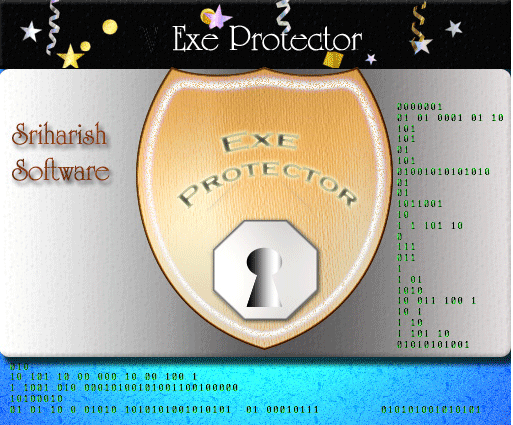



## EXE Protector v1\.2\-\-\>7 Hardware Fingerprints, Memory Encryption, Public Key Encryption and More

### Description

This is the major update of my AWARD WINNING code(now supports all major EXE's-VB, Delphi, VC++,FLASH etc.) this submission has a number of new features, and has almost everything you find in commercial software protectors. Convert your Exe Files into trial versions within few minutes, everything has been taken care of and exe's protected with this open source version is almost uncrakable. There are number of Anti Dumping and Anti Debug measures implemented in the loader like MEMORY ENCRYPTION, MEMORY STRIP, Debugger detection systems and more. If you implement these protection then it becomes very difficult for the cracker to to dump your software from the memory. And there is VARIABLE KEYS- it means that no one can make registry erasing cracks any more, Exe Protector stores data in different locations on each computer. Registration key system is also technically advanced because of MONITORING THREAD running in background so its impossible to load any cracking tools while exe protector is running and registration now supports 15 different hardwarefingerprints like SMART (the most unique number a computer has), BIOS, VOLUME, GEOMETRY, CPU INFO, MEMORY. With four cool trial systems TRIAL BY DAYS, TRIAL BY DATE, TRIAL BY COUNT,TRIAL BY VERSION which you can implement in your protected software. With Language editor you can put your own custom texts in the loader. Loader uses Advanced Tamper detection systems and loader immediately blocks the access to your software if any information is manually modiifed, but still a user can unblock it with UNBLOCK KEY.The loader is extremely fast, it is tested under different conditions and it works pretty well.There are many customisable options like you can choose to give FREE UPDATES for minor versions of your software, reset trial on new versions, add BUY NOW URL's, increase trial count by request, password access to reigstration menu and more. And thats not all Exe Protector now supports SDK from which you can add programatic functions to your software like GetRegstrationName, InstallKey, InitiateCreep. There is a feature in SDK called "Creep" i call it creep because it silently keep cracker away from your software. The "Creeps" should be spread all around your software like in the functions where some serious programming is done, now exe protector will secure all the places where "creep" is implemented. Thanks to Public Key Encryption Module- now your software is uncrackable even in this open source version. The author can store a lot of information in the registration key like Datecreated, Creator, Purchase date, Customer's info, test registration keys with VIRTUAL KEY TESTER which supports hardwarefingerprints, generate keys that can be used only withing certain time. Easily save projects, generate XML based reports and what else do you want?. You are getting a techincally advanced software protection system which is also secure in this open source version so please put some effort and VOTE FOR THIS CODE.
 
### More Info
 

             |
---                |---
**Submitted On**   |2004-12-31 18:37:04
**By**             |[Sriharish\.H](https://github.com/Planet-Source-Code/PSCIndex/blob/master/ByAuthor/sriharish-h.md)
**Level**          |Advanced
**User Rating**    |4.8 (665 globes from 140 users)
**Compatibility**  |VB 6\.0
**Category**       |[Complete Applications](https://github.com/Planet-Source-Code/PSCIndex/blob/master/ByCategory/complete-applications__1-27.md)
**World**          |[Visual Basic](https://github.com/Planet-Source-Code/PSCIndex/blob/master/ByWorld/visual-basic.md)
**Archive File**   |[EXE\_Protec183517112005\.zip](https://github.com/Planet-Source-Code/sriharish-h-exe-protector-v1-2-7-hardware-fingerprints-memory-encryption-public-key-encryp__1-58026/archive/master.zip)

